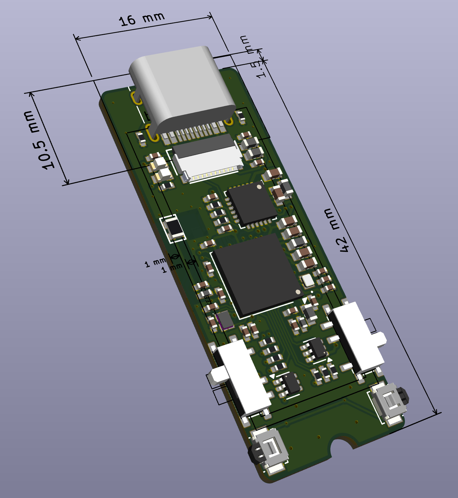
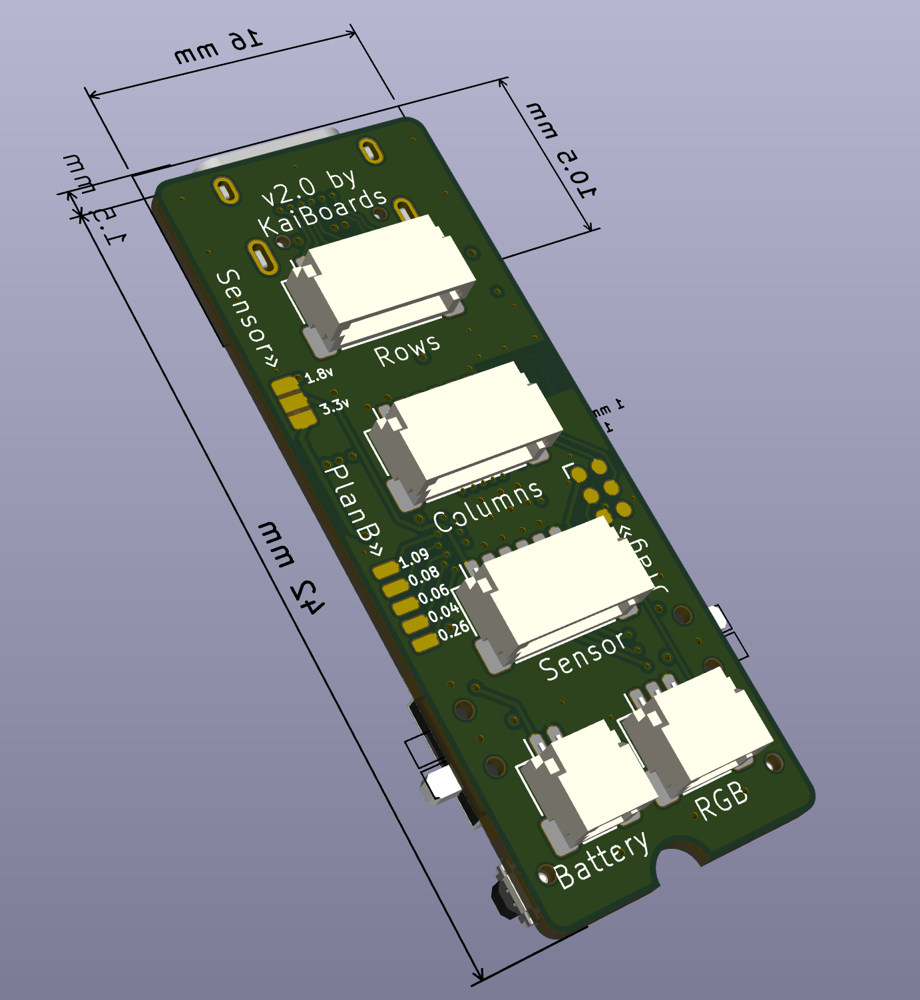

# Plan B

This is a tiny opinionated PCB that has everything packed in one place for
creating split bluetooth keyboards on top of nrf52840 chip and ZMK firmware

Think about it as

- an improved nice!nano clone in a smaller package
- has baked nice!view inside with a slot for LCD
- has baked in RGB controller
- has baked in 6-pin SPI interface for external sensor
- has baked in wiring for 6x6 keyboard matrix via JST connectors
- has baked in power/reset switches for both sides
- built in 1.8v power supply for externals
- high efficiency DC/DC buck converters for all power lines
- heavily fabrication optimised BOM and PCB (est $130 per 5 units at JLCPCB)

All in a tiny 14x42mm package, which is about 8m longer than nice!view shield

  
  

## Copyright & License

Everything is released under the terms of the CC BY-SA 4.0 license

© 2025 Kai Evans
